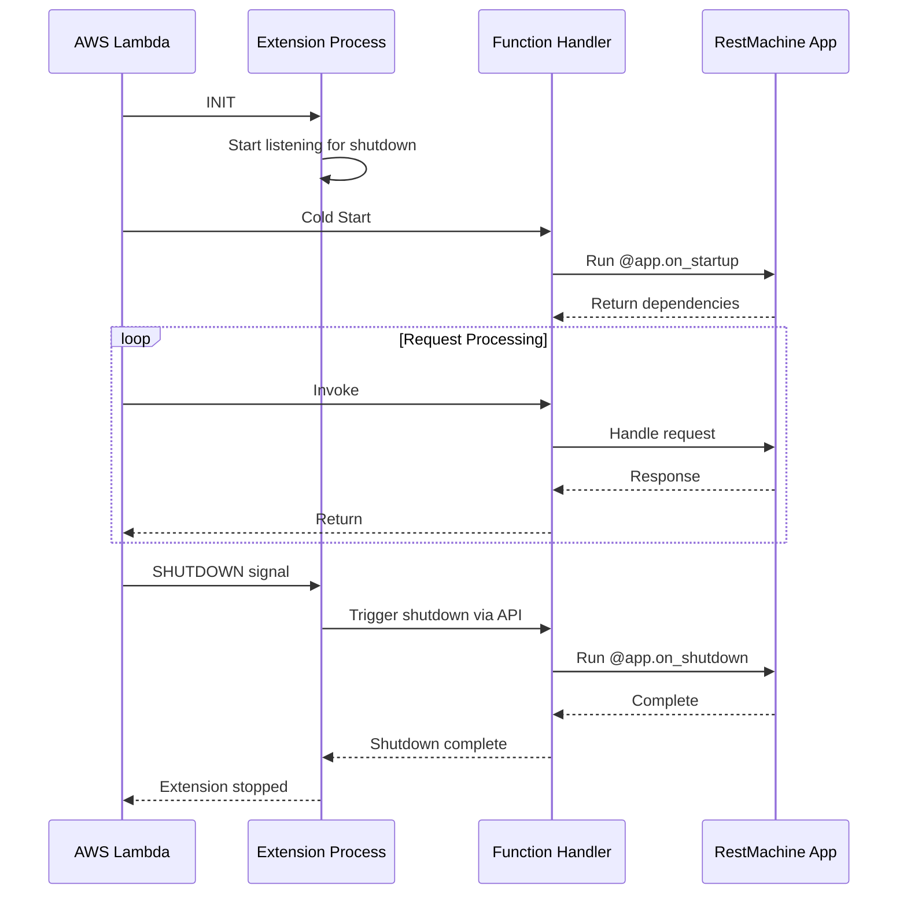

# Lambda Extensions

AWS Lambda Extensions allow you to run code during Lambda lifecycle events, including shutdown. RestMachine provides a Lambda Extension to support `@app.on_shutdown` handlers in serverless environments.

## Why Lambda Extensions?

Lambda functions don't have a traditional shutdown phase - they're frozen after execution. This makes it difficult to clean up resources like:

- Database connections
- File handles
- Cache flush
- Metrics reporting

The RestMachine Lambda Extension solves this by:

1. Running as a separate process alongside your Lambda function
2. Listening for shutdown signals from AWS
3. Calling your `@app.on_shutdown` handlers before termination

## Installation

### 1. Generate the Extension

RestMachine includes a CLI tool to generate the extension:

```bash
python -m restmachine_aws create-extension
```

This creates `extensions/restmachine-shutdown` in your project directory.

### 2. Include in Deployment Package

Add the extension to your Lambda deployment package:

```bash
# Create deployment structure
mkdir -p extensions
python -m restmachine_aws create-extension

# Package Lambda function with extension
zip -r lambda_function.zip lambda_handler.py extensions/
```

### 3. Deploy to Lambda

The extension is automatically discovered by AWS Lambda:

```bash
aws lambda update-function-code \
  --function-name my-function \
  --zip-file fileb://lambda_function.zip
```

## Using Shutdown Handlers

Define shutdown handlers in your application:

```python
from restmachine import RestApplication
from restmachine_aws import AwsApiGatewayAdapter

app = RestApplication()

# Startup handler (runs on cold start)
@app.on_startup
def database():
    print("Opening database connection...")
    return create_db_connection()

# Route that uses the database
@app.get('/users')
def list_users(database):
    return database.query("SELECT * FROM users")

# Shutdown handler (runs when Lambda shuts down)
@app.on_shutdown
def close_database(database):
    print("Closing database connection...")
    database.close()
    print("Database closed successfully")

# AWS Lambda adapter
adapter = AwsApiGatewayAdapter(app)

def lambda_handler(event, context):
    return adapter.handle_event(event, context)
```

## How It Works



## Extension Lifecycle

### 1. Initialization Phase

```python
# Extension registers with Lambda Runtime API
POST /runtime/init/error
# Extension declares shutdown handler
```

### 2. Request Processing

Your Lambda function handles requests normally. Shutdown handlers are **not** called between invocations.

### 3. Shutdown Phase

When AWS decides to shut down the Lambda environment:

```python
# Extension receives SHUTDOWN event
# Extension calls shutdown endpoint: POST http://localhost:PORT/shutdown
# Your @app.on_shutdown handlers execute
# Extension reports completion
```

## Configuration

### Environment Variables

Configure the extension behavior:

```python
# In your Lambda configuration
Environment:
  RESTMACHINE_EXTENSION_PORT: "8080"  # Port for shutdown API (default: 8080)
  RESTMACHINE_EXTENSION_TIMEOUT: "5"  # Shutdown timeout in seconds (default: 5)
```

### Dependency Injection

Shutdown handlers support dependency injection, allowing you to inject startup dependencies:

```python
@app.on_startup
def database():
    return {"connection": create_connection()}

@app.on_startup
def cache():
    return {"client": redis.Redis()}

@app.on_shutdown
def cleanup(database, cache):
    # Both dependencies injected!
    database["connection"].close()
    cache["client"].close()
```

## Example: Database Connection Pool

Complete example with connection pooling:

```python
from restmachine import RestApplication
from restmachine_aws import AwsApiGatewayAdapter
import psycopg2
from psycopg2 import pool

app = RestApplication()

@app.on_startup
def db_pool():
    """Create connection pool on cold start."""
    print("Creating database connection pool...")
    return psycopg2.pool.SimpleConnectionPool(
        minconn=1,
        maxconn=10,
        host="mydb.example.com",
        database="myapp",
        user="user",
        password="password"
    )

@app.get('/users/{user_id}')
def get_user(db_pool, request):
    """Use connection from pool."""
    conn = db_pool.getconn()
    try:
        with conn.cursor() as cur:
            cur.execute("SELECT * FROM users WHERE id = %s",
                       (request.path_params['user_id'],))
            user = cur.fetchone()
            return {"user": user}
    finally:
        db_pool.putconn(conn)

@app.on_shutdown
def close_db_pool(db_pool):
    """Close all connections on shutdown."""
    print("Closing database connection pool...")
    db_pool.closeall()
    print("All database connections closed")

adapter = AwsApiGatewayAdapter(app)

def lambda_handler(event, context):
    return adapter.handle_event(event, context)
```

## Monitoring & Debugging

### CloudWatch Logs

Shutdown handlers write to CloudWatch Logs:

```
[Extension] Shutdown signal received
[Function] Closing database connection pool...
[Function] All database connections closed
[Extension] Shutdown handlers completed successfully
```

### Testing Locally

Test shutdown handlers without deploying:

```python
# Simulate startup
from restmachine_aws import AwsApiGatewayAdapter

app = RestApplication()
# ... define handlers ...

adapter = AwsApiGatewayAdapter(app)

# Manually trigger shutdown
adapter._execute_shutdown_handlers()
```

## Limitations

1. **5-Second Timeout**: Extensions have limited time during shutdown
2. **No Guarantees**: AWS may forcibly terminate if timeout exceeded
3. **Cold Start Only**: Shutdown doesn't run between warm invocations
4. **No Return Values**: Shutdown handlers shouldn't return data

## Best Practices

1. **Keep Shutdown Fast**: Close connections quickly, don't perform complex cleanup
2. **Log Everything**: Use print/logging to track shutdown execution
3. **Handle Failures**: Use try/except to ensure shutdown completes even if one handler fails
4. **Test Thoroughly**: Test shutdown logic locally before deploying

## Troubleshooting

??? question "Shutdown handlers not running"
    - Verify extension is included in deployment package
    - Check `extensions/` directory exists in Lambda
    - Review CloudWatch logs for extension errors

??? question "Timeout errors during shutdown"
    - Reduce cleanup operations
    - Increase `RESTMACHINE_EXTENSION_TIMEOUT`
    - Remove blocking I/O from shutdown handlers

??? question "Extension causing cold start delay"
    - Extension adds ~50-100ms to cold start
    - This is normal and acceptable for most use cases
    - Consider if you really need shutdown handlers

## See Also

- [Startup & Shutdown Handlers](lifecycle.md) - General lifecycle documentation
- [AWS Lambda Deployment](../guide/deployment/aws-lambda.md) - Lambda deployment guide
- [Dependency Injection](../guide/dependency-injection.md) - DI patterns
