# State Machine

RestMachine uses a webmachine-inspired state machine to process HTTP requests. This provides robust, standards-compliant HTTP handling with proper status codes and conditional request support.

## Overview

The state machine processes every request through a series of decision points, each checking a specific aspect of the HTTP protocol. Based on the results, it either continues to the next state or returns an appropriate HTTP response.

### Key Features

- **Standards Compliant**: Follows HTTP/1.1 specification (RFC 7231-7235)
- **Conditional Requests**: Full support for ETags and Last-Modified
- **Content Negotiation**: Automatic Accept header processing
- **Customizable**: Override any decision point with decorators
- **Efficient**: Optimized for minimal overhead

## State Machine Flow

The diagram below shows the complete request processing flow, organized in a grid layout inspired by the [webmachine](https://webmachine.github.io/) state machine.

### Grid Layout

States are organized into **columns** (letters) and **rows** (numbers):

- **Column B** (rows 13-5): Service and route validation
- **Column G** (rows 7-3): Resource existence and conditional request checks
- **Column C** (rows 4-3): Content negotiation

For example, **B13** means "Column B, row 13" - the first decision point checking if a route exists.

This naming convention comes from webmachine and helps identify which phase of request processing each state belongs to.

!!! tip "Viewing the Diagram"
    - Click the **Expand Diagram** button below for fullscreen view with zoom/pan controls
    - **Desktop controls**:
        - **Scroll** with mouse wheel to zoom in/out
        - **Drag** with mouse to pan around the diagram
        - **Arrow keys** (↑ ↓ ← →) to pan up/down/left/right
        - **+/-** buttons for precise zoom control
        - **⊙** button to reset view to initial position
        - **ESC** or **×** to close
    - **Mobile/Touch controls**:
        - **Drag** with one finger to pan
        - **Pinch** with two fingers to zoom in/out
        - **Tap** **×** button to close
    - Copy the diagram code to [Mermaid Live Editor](https://mermaid.live/) for interactive editing

```mermaid
flowchart LR
    START([Request]) --> B13

    %% Column B: Service & Route Validation (rows 13-5)
    subgraph B[" Column B: Service & Route Validation "]
        direction TB
        B13{B13: Route<br/>Exists?}
        B12{B12: Service<br/>Available?}
        B11{B11: Known<br/>Method?}
        B10{B10: URI<br/>Too Long?}
        B9{B9: Method<br/>Allowed?}
        B8{B8: Malformed<br/>Request?}
        B7{B7: Authorized?}
        B6{B6: Forbidden?}
        B5{B5: Valid Content<br/>Headers?}
    end

    %% Column G: Resource & Conditional Checks (rows 7-3)
    subgraph G[" Column G: Resource & Conditional Checks "]
        direction TB
        G7{G7: Resource<br/>Exists?}
        G6{G6: If-Modified-<br/>Since?}
        G5{G5: If-None-Match<br/>Header?}
        G4{G4: If-Unmodified-<br/>Since?}
        G3{G3: If-Match<br/>Header?}
    end

    %% Column C: Content Negotiation (rows 4-3)
    subgraph C[" Column C: Content Negotiation "]
        direction TB
        C4{C4: Acceptable<br/>Content Type?}
        C3{C3: Content Types<br/>Available?}
    end

    %% Error Response States
    subgraph ERRORS[" Error Responses "]
        direction TB
        R404[404 Not Found]
        R405[405 Method<br/>Not Allowed]
        R400[400 Bad<br/>Request]
        R401[401<br/>Unauthorized]
        R403[403<br/>Forbidden]
        R412[412 Precondition<br/>Failed]
        R406[406 Not<br/>Acceptable]
        R414[414 URI<br/>Too Long]
        R501[501 Not<br/>Implemented]
        R503[503 Service<br/>Unavailable]
        R500[500 Internal<br/>Server Error]
    end

    %% Success Response States
    subgraph SUCCESS_STATES[" Success Responses "]
        direction TB
        R304[304 Not<br/>Modified]
        R204[204 No<br/>Content]
        EXEC[Execute Handler<br/>& Render]
        RETURN[Return Response]
    end

    %% Column B Flow (top to bottom)
    B13 -->|Yes| B12
    B12 -->|Yes| B11
    B11 -->|Yes| B10
    B10 -->|No| B9
    B9 -->|Yes| B8
    B8 -->|No| B7
    B7 -->|Yes| B6
    B6 -->|No| B5

    %% B Column to Errors
    B13 -->|No| PATH_CHECK{Path has<br/>other routes?}
    PATH_CHECK -->|Yes| R405
    PATH_CHECK -->|No| R404
    B12 -->|No| R503
    B11 -->|No| R501
    B10 -->|Yes| R414
    B9 -->|No| R405
    B8 -->|Yes| R400
    B7 -->|No| R401
    B6 -->|Yes| R403
    B5 -->|No| R400

    %% B Column to G Column
    B5 -->|Yes| G7

    %% Column G Flow
    G7 -->|Yes| COND_CHECK{Conditional<br/>Headers?}
    COND_CHECK -->|Yes| G3
    G3 -->|No or Match| G4
    G4 -->|No or Not Modified| G5
    G5 -->|No Match| G6

    %% G Column to Errors
    G7 -->|No & Other| R404
    G3 -->|No Match| R412
    G4 -->|Modified| R412
    G5 -->|Match & GET| R304
    G5 -->|Match & Other| R412
    G6 -->|Not Modified| R304

    %% G Column to C Column
    G7 -->|No & POST| C3
    COND_CHECK -->|No| C3
    G6 -->|No or Modified| C3

    %% Column C Flow
    C3 -->|Yes| C4

    %% C Column to Errors
    C3 -->|No| R500
    C4 -->|No| R406

    %% C Column to Success
    C4 -->|Yes| EXEC

    %% Success Flow
    EXEC --> RESPONSE_CHECK{Response<br/>Type?}
    RESPONSE_CHECK -->|None| R204
    RESPONSE_CHECK -->|Response Object| RETURN
    RESPONSE_CHECK -->|Data| RENDER[Render with<br/>Content Type]
    RENDER --> RETURN

    %% Style error responses (red)
    style R404 fill:#f88,stroke:#333,stroke-width:2px
    style R405 fill:#f88,stroke:#333,stroke-width:2px
    style R400 fill:#f88,stroke:#333,stroke-width:2px
    style R401 fill:#f88,stroke:#333,stroke-width:2px
    style R403 fill:#f88,stroke:#333,stroke-width:2px
    style R412 fill:#f88,stroke:#333,stroke-width:2px
    style R406 fill:#f88,stroke:#333,stroke-width:2px
    style R414 fill:#f88,stroke:#333,stroke-width:2px
    style R501 fill:#f88,stroke:#333,stroke-width:2px
    style R503 fill:#f88,stroke:#333,stroke-width:2px
    style R500 fill:#f88,stroke:#333,stroke-width:2px

    %% Style success responses (green)
    style R304 fill:#8f8,stroke:#333,stroke-width:2px
    style R204 fill:#8f8,stroke:#333,stroke-width:2px
    style RETURN fill:#8f8,stroke:#333,stroke-width:2px

    %% Style processing states (blue)
    style EXEC fill:#88f,stroke:#333,stroke-width:2px
    style RENDER fill:#88f,stroke:#333,stroke-width:2px
```

<div class="mermaid-fullscreen-wrapper">
    <button class="mermaid-fullscreen-btn">⛶ Expand Diagram</button>
</div>



## State Descriptions

### Route and Service Checks (B13-B9)

#### B13: Route Exists
**Decision**: Does a route exist for this method and path?

- **No**: Check if path has routes for other methods
  - If yes → 405 Method Not Allowed
  - If no → 404 Not Found
- **Yes**: Continue to service availability check

#### B12: Service Available
**Decision**: Is the service available to handle requests?

- **No**: 503 Service Unavailable
- **Yes**: Continue to known method check

**Override with decorator**:
```python
@app.service_available
def check_service(request):
    # Check if service is in maintenance mode
    if maintenance_mode:
        return False
    return True
```

#### B11: Known Method
**Decision**: Is the HTTP method known/supported?

- **No**: 501 Not Implemented
- **Yes**: Continue to URI check

**Default known methods**: GET, POST, PUT, DELETE, PATCH

**Override**:
```python
@app.known_method
def check_method(request):
    allowed = {'GET', 'POST', 'PUT', 'DELETE', 'PATCH', 'OPTIONS'}
    return request.method.value in allowed
```

#### B10: URI Too Long
**Decision**: Is the URI too long?

- **Yes**: 414 URI Too Long
- **No**: Continue to method allowed check

**Override**:
```python
@app.uri_too_long
def check_uri_length(request):
    return len(request.path) > 2000
```

#### B9: Method Allowed
**Decision**: Is the method allowed for this resource?

- **No**: 405 Method Not Allowed
- **Yes**: Continue to malformed check

### Request Validation (B8-B5)

#### B8: Malformed Request
**Decision**: Is the request malformed?

- **Yes**: 400 Bad Request
- **No**: Continue to authorization

**Override**:
```python
@app.malformed_request
def check_request(request):
    # Custom validation logic
    if not request.headers.get('content-type'):
        return True
    return False
```

#### B7: Authorized
**Decision**: Is the request authorized?

- **No**: 401 Unauthorized
- **Yes**: Continue to forbidden check

**Override**:
```python
@app.authorized
def check_auth(request):
    token = request.headers.get('authorization')
    if not token:
        return False
    return validate_token(token)
```

#### B6: Forbidden
**Decision**: Is access forbidden for this user?

- **Yes**: 403 Forbidden
- **No**: Continue to content header validation

**Override**:
```python
@app.forbidden
def check_forbidden(request, current_user):
    # Check if user has permission
    if current_user.role != 'admin':
        return True
    return False
```

#### B5: Valid Content Headers
**Decision**: Are the content headers valid?

- **No**: 400 Bad Request
- **Yes**: Continue to resource existence

**Override**:
```python
@app.valid_content_headers
def check_headers(request):
    content_type = request.headers.get('content-type')
    if request.method in ['POST', 'PUT']:
        return content_type is not None
    return True
```

### Resource Existence (G7)

#### G7: Resource Exists
**Decision**: Does the resource exist?

- **No & POST**: Continue to content negotiation (creating resource)
- **No & Other**: 404 Not Found
- **Yes**: Check for conditional headers

**Override with dependency**:
```python
@app.resource_exists
def get_user(request):
    user_id = request.path_params['user_id']
    user = database.get(user_id)
    if not user:
        return None  # Triggers 404
    return user  # Cached for use in handler
```

### Conditional Request Processing (G3-G6)

These states implement ETags and Last-Modified conditional requests:

#### G3: If-Match
**Decision**: Does the If-Match header match?

- **Header not present**: Continue to G4
- **Match or \***: Continue to G4
- **No match**: 412 Precondition Failed

**Used for**: Preventing mid-air collisions in updates

```python
@app.etag
def get_etag(resource):
    import hashlib
    content = json.dumps(resource, sort_keys=True)
    return f'"{hashlib.md5(content.encode()).hexdigest()}"'
```

#### G4: If-Unmodified-Since
**Decision**: Has resource been modified since specified date?

- **Header not present**: Continue to G5
- **Not modified**: Continue to G5
- **Modified**: 412 Precondition Failed

```python
@app.last_modified
def get_last_modified(resource):
    from datetime import datetime
    return datetime.fromisoformat(resource['updated_at'])
```

#### G5: If-None-Match
**Decision**: Does the If-None-Match header match?

- **Header not present**: Continue to G6
- **Match & GET**: 304 Not Modified
- **Match & Other**: 412 Precondition Failed
- **No match**: Continue to G6

**Used for**: Efficient caching with ETags

#### G6: If-Modified-Since
**Decision**: Has resource been modified since specified date?

- **Header not present or not GET**: Continue to content negotiation
- **Not modified**: 304 Not Modified
- **Modified**: Continue to content negotiation

**Used for**: Efficient caching with timestamps

### Content Negotiation (C3-C4)

#### C3: Content Types Provided
**Decision**: Are content types available?

- **No**: 500 Internal Server Error
- **Yes**: Continue to acceptance check

#### C4: Acceptable Content Type
**Decision**: Can we provide an acceptable content type?

- **No**: 406 Not Acceptable
- **Yes**: Execute handler and render

**Content negotiation**:
```python
@app.content_renderer("application/json")
def json_renderer(data):
    return json.dumps(data)

@app.content_renderer("application/xml")
def xml_renderer(data):
    return f"<data>{data}</data>"
```

### Handler Execution (Terminal State)

**Execute Handler & Render**: The final state that:

1. Processes header dependencies
2. Executes the route handler
3. Validates Pydantic return types (if used)
4. Renders response with chosen content type
5. Returns appropriate status code:
   - **None** → 204 No Content
   - **Response object** → Use response as-is
   - **Data** → Render with content type → 200 OK

## Decorator Reference

### State Override Decorators

Override decision points for specific routes:

```python
from restmachine import RestApplication

app = RestApplication()

# Service availability
@app.service_available
def check_service(request):
    return not maintenance_mode

# Method checking
@app.known_method
def check_method(request):
    return request.method.value in ALLOWED_METHODS

# Authorization
@app.authorized
def check_auth(request):
    return validate_token(request.headers.get('authorization'))

# Access control
@app.forbidden
def check_permission(request, current_user):
    return current_user.role not in ['admin', 'moderator']

# Resource existence (with caching)
@app.resource_exists
def get_resource(request):
    resource_id = request.path_params['id']
    return database.get(resource_id)  # None = 404

# ETag for conditional requests
@app.etag
def calculate_etag(resource):
    import hashlib
    return f'"{hashlib.md5(str(resource).encode()).hexdigest()}"'

# Last-Modified for conditional requests
@app.last_modified
def get_last_modified(resource):
    return resource['updated_at']
```

### Route-Specific Overrides

Apply decorators to specific routes:

```python
@app.get('/admin/users')
@app.authorized
def check_admin_auth(request):
    token = request.headers.get('authorization')
    if not token:
        return False
    user = validate_token(token)
    return user and user.role == 'admin'

def list_users():
    return {"users": [...]}
```

## HTTP Status Code Reference

### Client Errors (4xx)

| Code | State | Meaning |
|------|-------|---------|
| 400 | B8, B5 | Bad Request - Malformed request or invalid headers |
| 401 | B7 | Unauthorized - Authentication required |
| 403 | B6 | Forbidden - Authenticated but not authorized |
| 404 | B13, G7 | Not Found - Resource doesn't exist |
| 405 | B13, B9 | Method Not Allowed - Method not allowed for this resource |
| 406 | C4 | Not Acceptable - Cannot provide acceptable content type |
| 412 | G3, G4, G5 | Precondition Failed - Conditional request failed |
| 414 | B10 | URI Too Long - URI exceeds length limit |

### Server Errors (5xx)

| Code | State | Meaning |
|------|-------|---------|
| 500 | C3 | Internal Server Error - No content renderers available |
| 501 | B11 | Not Implemented - HTTP method not supported |
| 503 | B12 | Service Unavailable - Service temporarily unavailable |

### Success Codes (2xx/3xx)

| Code | State | Meaning |
|------|-------|---------|
| 200 | Exec | OK - Successful request with body |
| 204 | Exec | No Content - Successful request, no body |
| 304 | G5, G6 | Not Modified - Resource not modified (conditional) |

## Examples

### Basic Resource with Conditional Requests

```python
from restmachine import RestApplication
from datetime import datetime
import hashlib
import json

app = RestApplication()

@app.on_startup
def database():
    return {
        "users": {
            "1": {
                "id": "1",
                "name": "Alice",
                "email": "alice@example.com",
                "updated_at": "2024-01-15T10:00:00Z"
            }
        }
    }

# Resource existence check (G7)
@app.resource_exists
def get_user(request, database):
    user_id = request.path_params.get('user_id')
    user = database["users"].get(user_id)
    if not user:
        return None  # Triggers 404
    return user  # Cached for use in handler

# ETag calculation (G3, G5)
@app.etag
def user_etag(get_user):
    if not get_user:
        return None
    user_json = json.dumps(get_user, sort_keys=True)
    return f'"{hashlib.md5(user_json.encode()).hexdigest()}"'

# Last-Modified (G4, G6)
@app.last_modified
def user_last_modified(get_user):
    if not get_user:
        return None
    return datetime.fromisoformat(get_user['updated_at'].replace('Z', '+00:00'))

@app.get('/users/{user_id}')
def get_user_endpoint(get_user):
    """
    State flow:
    1. B13: Route exists ✓
    2. B12-B5: Checks pass ✓
    3. G7: Resource exists ✓ (get_user dependency)
    4. G3: If-Match checked
    5. G4: If-Unmodified-Since checked
    6. G5: If-None-Match checked (may return 304)
    7. G6: If-Modified-Since checked (may return 304)
    8. C3-C4: Content negotiation
    9. Execute & render → 200 OK
    """
    return get_user
```

### Protected Resource with Authorization

```python
# Authorization check (B7)
@app.authorized
def check_auth(request):
    token = request.headers.get('authorization', '')
    if not token.startswith('Bearer '):
        return False
    return validate_token(token[7:])

# Permission check (B6)
@app.forbidden
def check_admin(request):
    token = request.headers.get('authorization', '')[7:]
    user = get_user_from_token(token)
    # Return True if forbidden
    return user.role != 'admin'

@app.delete('/users/{user_id}')
def delete_user(request, database):
    """
    State flow:
    1. B13-B11: Route and service checks ✓
    2. B10-B9: URI and method checks ✓
    3. B8: Not malformed ✓
    4. B7: Authorized? (checks token)
    5. B6: Forbidden? (checks admin role)
    6. G7-C4: Resource and content checks
    7. Execute → 204 No Content
    """
    user_id = request.path_params['user_id']
    del database["users"][user_id]
    return None  # 204 No Content
```

### Custom Service Availability

```python
import os

# Service availability check (B12)
@app.service_available
def check_maintenance(request):
    # Allow health checks during maintenance
    if request.path == '/health':
        return True

    # Check maintenance mode
    return not os.environ.get('MAINTENANCE_MODE')

@app.get('/health')
def health_check():
    return {"status": "ok"}

@app.get('/api/data')
def get_data():
    """
    State flow in maintenance mode:
    1. B13: Route exists ✓
    2. B12: Service available? (returns 503)

    Normal flow:
    1. B13: Route exists ✓
    2. B12: Service available ✓
    3. ... continues to execution
    """
    return {"data": [...]}
```

## Performance Considerations

### State Machine Overhead

The state machine adds minimal overhead:

- **Without decorators**: ~5-10 states per request
- **With decorators**: Additional states as needed
- **Conditional requests**: +4 states (G3-G6) only when headers present
- **Max states**: 50 (safety limit)

### Optimization Tips

1. **Skip unnecessary checks**: Don't use decorators unless needed
2. **Cache dependencies**: Resource checks are cached automatically
3. **Conditional headers**: Only processed when headers present
4. **Content negotiation**: Cached per request

### Bypass State Machine

For maximum performance on simple endpoints:

```python
@app.get('/ping', bypass_state_machine=True)
def ping():
    """Ultra-fast endpoint, skips all state machine processing."""
    return {"pong": True}, 200, {'Content-Type': 'application/json'}
```

## Comparison with Other Frameworks

### vs Flask/FastAPI

Traditional frameworks use middleware:

```python
# Flask/FastAPI style
@app.middleware
def check_auth(request, call_next):
    if not is_authenticated(request):
        return Response(401)
    return call_next(request)
```

RestMachine uses decision states:

```python
# RestMachine style
@app.authorized
def check_auth(request):
    return is_authenticated(request)
```

**Advantages**:
- Clearer HTTP semantics
- Proper status codes automatically
- Standards-compliant conditional requests
- Built-in content negotiation

## Next Steps

- [Lifecycle →](lifecycle.md) - Application lifecycle management
- [Performance →](performance.md) - Optimization techniques
- [Headers →](headers.md) - Working with HTTP headers
- [Testing →](../guide/testing.md) - Test state machine behavior
