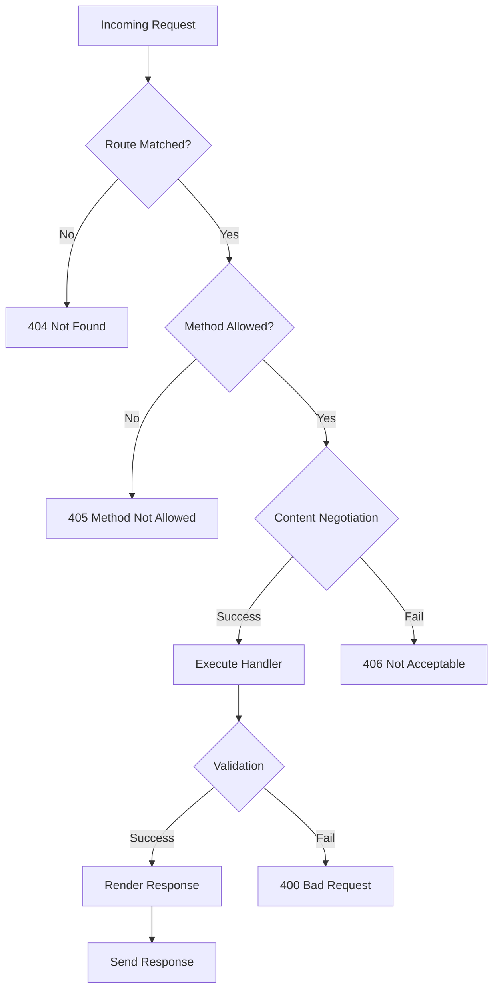

# Overview

RestMachine is a Python REST framework designed to make building APIs simple while providing powerful features when you need them.

## Philosophy

RestMachine is designed to get out of your way:

1. **Simple by default** - Start with minimal code, add features as needed
2. **Explicit over implicit** - Clear, readable code over hidden behavior
3. **Easy testing** - Share resources cleanly without global state
4. **HTTP done right** - Automatic content negotiation, proper status codes, standards-compliant behavior
5. **Deploy anywhere** - Same code runs locally or in AWS Lambda

## Architecture

### Smart Request Processing

RestMachine handles HTTP requests intelligently, exposing useful information about what's happening:

- **Automatic content negotiation** - Serves JSON, XML, or custom formats based on client preferences
- **Conditional requests** - Built-in support for ETags, If-Modified-Since, and other cache headers
- **Correct status codes** - Returns 404, 405, 406, etc. automatically based on request context
- **Inspectable facts** - Access details like accepted content types, authentication status, and request validity at any point in your handler



### Sharing Resources

Share resources like database connections across handlers without global variables:

```python
@app.dependency()
def database():
    return create_db_connection()

@app.get('/users')
def list_users(database):  # 'database' automatically provided
    return database.query("SELECT * FROM users")
```

Resources are created once per request and cached automatically, so expensive operations (like opening database connections) only happen when needed.

## Core Concepts

### Application

The `RestApplication` is the main entry point:

```python
from restmachine import RestApplication

app = RestApplication()
```

### Routes

Routes are defined using decorators:

```python
@app.get('/users/{user_id}')
def get_user(path_params):
    user_id = path_params['user_id']
    return {"id": user_id}
```

Supported HTTP methods:
- `@app.get(path)`
- `@app.post(path)`
- `@app.put(path)`
- `@app.patch(path)`
- `@app.delete(path)`
- `@app.head(path)`
- `@app.options(path)`

### Request & Response

- **Request** - Contains method, path, headers, body, query params, path params
- **Response** - Can be dict (auto-serialized), string, or explicit Response object

```python
from restmachine import Response

@app.get('/custom')
def custom_response():
    return Response(
        status_code=201,
        body="Created",
        headers={"X-Custom": "Header"}
    )
```

### Content Negotiation

RestMachine automatically negotiates content types based on the `Accept` header:

```python
@app.content_renderer("application/json")
def render_json(data):
    import json
    return json.dumps(data)

@app.content_renderer("application/xml")
def render_xml(data):
    return f"<data>{data}</data>"
```

Requests with `Accept: application/json` will use the JSON renderer, while `Accept: application/xml` will use the XML renderer.

## Deployment Options

RestMachine supports multiple deployment targets:

| Deployment | Use Case | Adapter |
|-----------|----------|---------|
| **ASGI Servers** | Production web servers | `ASGIAdapter` |
| **AWS Lambda** | Serverless, auto-scaling | `AwsApiGatewayAdapter` |
| **Direct** | Testing, development | `app.execute(request)` |

### ASGI Deployment

```python
from restmachine import ASGIAdapter

asgi_app = ASGIAdapter(app)
```

Run with any ASGI server:

```bash
uvicorn app:asgi_app --reload           # Uvicorn
hypercorn app:asgi_app --reload         # Hypercorn
daphne app:asgi_app                     # Daphne
```

### AWS Lambda Deployment

```python
from restmachine_aws import AwsApiGatewayAdapter

adapter = AwsApiGatewayAdapter(app)

def lambda_handler(event, context):
    return adapter.handle_event(event, context)
```

Supports:
- API Gateway REST API (v1)
- API Gateway HTTP API (v2)
- Application Load Balancer (ALB)
- Lambda Function URLs

## What's Next?

- [Installation →](installation.md) - Install RestMachine
- [Quick Start →](quickstart.md) - Build your first API
- [Basic Application →](../guide/basic-application.md) - Learn the fundamentals
