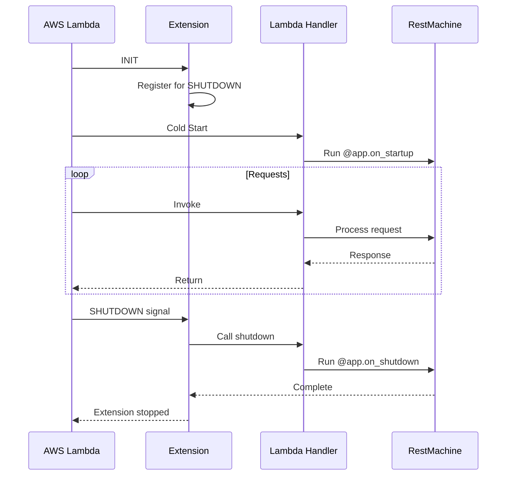

# Lambda Extension

::: restmachine_aws.extension.ShutdownExtension
    options:
      show_root_heading: true
      heading_level: 2

## Overview

The Lambda Extension enables shutdown handlers to run when your Lambda container terminates. This is essential for cleaning up resources like database connections, file handles, and pending operations.

## Why Use an Extension?

Lambda functions don't have a traditional shutdown phase - they're frozen after execution. The extension solves this by:

1. Running as a separate process alongside your Lambda function
2. Listening for SHUTDOWN signals from AWS
3. Calling your `@app.on_shutdown` handlers before termination

## Installation

### 1. Create Extension Script

Create `extensions/restmachine-shutdown` in your Lambda deployment package:

```python
#!/usr/bin/env python3
from restmachine_aws.extension import main

if __name__ == "__main__":
    main()
```

### 2. Make It Executable

```bash
chmod +x extensions/restmachine-shutdown
```

### 3. Deploy with Lambda

The extension is automatically discovered when included in your deployment package:

```
lambda_function/
├── lambda_function.py      # Your Lambda handler
├── extensions/
│   └── restmachine-shutdown  # Extension (executable)
└── ...
```

## Using Shutdown Handlers

Define shutdown handlers in your application:

```python
from restmachine import RestApplication
from restmachine_aws import AwsApiGatewayAdapter

app = RestApplication()

@app.on_startup
def database():
    """Open database connection on cold start."""
    print("Opening database connection...")
    return create_db_connection()

@app.on_shutdown
def close_database(database):
    """Close database connection on shutdown."""
    print("Closing database connection...")
    database.close()
    print("Database closed successfully")

# AWS Lambda adapter
adapter = AwsApiGatewayAdapter(app)

def lambda_handler(event, context):
    return adapter.handle_event(event, context)
```

When AWS terminates the Lambda container, the extension calls `close_database()` automatically.

## How It Works



## Lifecycle Phases

### 1. Initialization

When Lambda starts:

```python
# Extension registers with Lambda Runtime API
# Declares interest in SHUTDOWN events
```

### 2. Request Processing

Your Lambda function handles requests normally. Shutdown handlers are **not** called between invocations.

### 3. Shutdown

When AWS terminates the container:

```python
# Extension receives SHUTDOWN event
# Extension imports your app and calls app.shutdown_sync()
# Your @app.on_shutdown handlers execute
# Extension reports completion to AWS
```

## Configuration

### Environment Variables

Configure extension behavior:

```yaml
# SAM template.yaml
Environment:
  Variables:
    RESTMACHINE_HANDLER_MODULE: "lambda_function"  # Module with your app
    RESTMACHINE_APP_NAME: "app"                    # Variable name
```

Defaults:
- `RESTMACHINE_HANDLER_MODULE`: `"lambda_function"`
- `RESTMACHINE_APP_NAME`: `"app"`

### Custom App Location

If your app is in a different module:

```python
# my_api/application.py
from restmachine import RestApplication

my_app = RestApplication()

@my_app.get("/hello")
def hello():
    return {"message": "Hello"}
```

Set environment variables:

```yaml
Environment:
  Variables:
    RESTMACHINE_HANDLER_MODULE: "my_api.application"
    RESTMACHINE_APP_NAME: "my_app"
```

## Resource Injection

Shutdown handlers support dependency injection:

```python
@app.on_startup
def database():
    return create_db_connection()

@app.on_startup
def cache():
    return redis.Redis()

@app.on_shutdown
def cleanup(database, cache):
    """Both dependencies are injected automatically."""
    database.close()
    cache.close()
```

## Example: Database Connection Pool

```python
from restmachine import RestApplication
from restmachine_aws import AwsApiGatewayAdapter
import psycopg2.pool

app = RestApplication()

@app.on_startup
def db_pool():
    """Create connection pool on cold start."""
    print("Creating database pool...")
    return psycopg2.pool.SimpleConnectionPool(
        minconn=1,
        maxconn=10,
        host="db.example.com",
        database="myapp",
        user="user",
        password="password"
    )

@app.get('/users/{user_id}')
def get_user(db_pool, request):
    """Use connection from pool."""
    conn = db_pool.getconn()
    try:
        with conn.cursor() as cur:
            cur.execute("SELECT * FROM users WHERE id = %s",
                       (request.path_params['user_id'],))
            user = cur.fetchone()
            return {"user": user}
    finally:
        db_pool.putconn(conn)

@app.on_shutdown
def close_pool(db_pool):
    """Close all connections on shutdown."""
    print("Closing database pool...")
    db_pool.closeall()
    print("All connections closed")

adapter = AwsApiGatewayAdapter(app)

def lambda_handler(event, context):
    return adapter.handle_event(event, context)
```

## Monitoring

### CloudWatch Logs

Shutdown handlers write to CloudWatch:

```
[Extension] Shutdown signal received
[Function] Closing database pool...
[Function] All connections closed
[Extension] Shutdown handlers completed successfully
```

### Testing Locally

Test shutdown without deploying:

```python
from restmachine_aws import AwsApiGatewayAdapter

app = RestApplication()

# ... define handlers ...

adapter = AwsApiGatewayAdapter(app)

# Manually trigger shutdown for testing
if hasattr(app, 'shutdown_sync'):
    app.shutdown_sync()
```

## Limitations

- **5-Second Timeout**: Extensions have limited time during shutdown
- **No Guarantees**: AWS may forcibly terminate if timeout exceeded
- **Cold Start Only**: Shutdown doesn't run between warm invocations
- **No Return Values**: Shutdown handlers shouldn't return data

## Best Practices

1. **Keep Shutdown Fast** - Close connections quickly, avoid complex cleanup
2. **Log Everything** - Use logging to track shutdown execution
3. **Handle Failures** - Use try/except to ensure shutdown completes
4. **Test Thoroughly** - Test shutdown logic locally before deploying

## Troubleshooting

### Shutdown Handlers Not Running

- Verify extension is included in deployment package
- Check `extensions/` directory exists in Lambda
- Review CloudWatch logs for extension errors

### Timeout Errors

- Reduce cleanup operations
- Remove blocking I/O from shutdown handlers

### Extension Causing Cold Start Delay

- Extension adds ~50-100ms to cold start
- This is normal and acceptable for most use cases

## CLI Tool

Generate extension script automatically:

```bash
python -m restmachine_aws create-extension
```

This creates `extensions/restmachine-shutdown` with proper permissions.

## See Also

- [Lambda Deployment Guide](../guides/lambda-deployment.md) - Complete deployment guide
- [Lambda Extensions Guide](../guides/lambda-extensions.md) - Detailed usage guide
- [Lifecycle Handlers](../../advanced/lifecycle.md) - General lifecycle patterns
