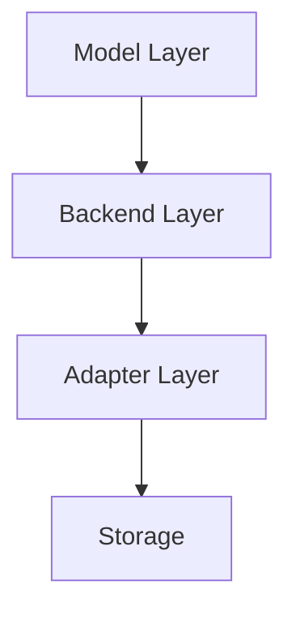

# RestMachine ORM

RestMachine ORM is an ActiveRecord-style ORM/ODM designed to provide a consistent interface across different backends including DynamoDB, OpenSearch, and in-memory storage.

## Features

- **ActiveRecord Pattern**: Models with built-in CRUD operations
- **Multiple Backends**: Support for DynamoDB, OpenSearch, and in-memory storage
- **Type Safety**: Built on Pydantic for robust validation
- **Flexible Querying**: Chainable query interface with filtering, ordering, and pagination
- **Composite Keys**: Support for DynamoDB-style partition and sort keys
- **Testing Framework**: Multi-backend testing DSL for consistency verification

## Philosophy

RestMachine ORM is designed around several core principles:

1. **Backend Agnostic**: Write your models once, deploy anywhere
2. **Type Safe**: Leverage Python's type hints and Pydantic's validation
3. **Developer Friendly**: Intuitive API inspired by ActiveRecord
4. **Testable**: Built-in testing framework for multi-backend verification

## Architecture

The ORM follows a 3-layer architecture:



- **Model Layer**: Pydantic-based models with ORM capabilities
- **Backend Layer**: Abstract interface for storage operations
- **Adapter Layer**: Backend-specific data transformation
- **Storage**: Actual data store (DynamoDB, OpenSearch, Memory, etc.)

## Quick Example

```python
from restmachine_orm import Model, Field
from restmachine_orm.backends import InMemoryBackend, InMemoryAdapter
from typing import ClassVar

class User(Model):
    model_backend: ClassVar = InMemoryBackend(InMemoryAdapter())

    id: str = Field(primary_key=True)
    email: str = Field(unique=True, index=True)
    name: str
    age: int = Field(ge=0, le=150, default=0)

# Create
user = User.create(id="user-1", email="alice@example.com", name="Alice", age=30)

# Read
user = User.get(id="user-1")

# Update
user.age = 31
user.save()

# Query
users = User.where().and_(age__gte=30).all()

# Delete
user.delete()
```

## Package Structure

The ORM is split into multiple packages:

- **restmachine-orm**: Core ORM functionality with in-memory backend
- **restmachine-orm-dynamodb**: DynamoDB backend implementation
- **restmachine-orm-opensearch**: OpenSearch backend (coming soon)

Each backend package can be installed independently:

```bash
# Core only (includes in-memory backend)
pip install restmachine-orm

# With DynamoDB support
pip install restmachine-orm restmachine-orm-dynamodb

# With all backends
pip install restmachine-orm[all]
```

## Next Steps

- [Installation Guide](getting-started/installation.md)
- [Quick Start Tutorial](getting-started/quickstart.md)
- [Basic Usage](getting-started/usage.md)
- [Backend Documentation](backends/inmemory.md)
